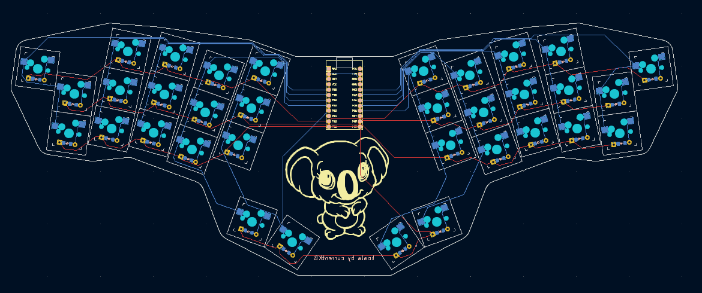

# koala keyboard

This is a 34-key column-staggered unibody keyboard.

## PCB

You can modify the [KiCad files](/kicad/) or straight download the [Gerber files](/gerber/) to order the PCB.

## BUILD GUIDE
  
The build guide for the koala can be found [here](/docs/buildguide.md).
## Firmware

### QWERTY
      ┌───┬───┬───┬───┬───┐   ┌───┬───┬───┬───┬───┐
      │ Q │ W │ E │ R │ T │   │ Y │ U │ I │ O │ P │
      ├───┼───┼───┼───┼───│   │───┼───┼───┼───┼───┤
      │ A │ S │ D │ F │ G │   │ H │ J │ K │ L │ ; │
      ├───┼───┼───┼───┼───│   │───┼───┼───┼───┼───┤
      │ Z │ X │ C │ V │ B │   │ N │ M │ , │ . │ / │
      └───┴───┴───┼───┼───│   │───┼───┼───┴───┴───┘
                  │Ent│Tab│   │Bsp│Spc│
                  └───┴───┘   └───┴───┘
[QMK config: QWERTY](https://github.com/currentkb/qmk_firmware/tree/feat/koala/keyboards/koala/keymaps/default)

[pre-built firmware: QWERTY](/firmware/koala_default.hex)
### COLEMAK DH
    
      ┌───┬───┬───┬───┬───┐   ┌───┬───┬───┬───┬───┐
      │ Q │ W │ F │ P │ B │   │ J │ L │ U │ Y │ ; │
      ├───┼───┼───┼───┼───│   │───┼───┼───┼───┼───┤
      │ A │ R │ S │ T │ G │   │ M │ N │ E │ I │ O │
      ├───┼───┼───┼───┼───│   │───┼───┼───┼───┼───┤
      │ Z │ X │ C │ D │ V │   │ K │ H │ , │ . │ / │
      └───┴───┴───┼───┼───│   │───┼───┼───┴───┴───┘
                  │Ent│Tab│   │Bsp│Spc│
                  └───┴───┘   └───┴───┘

[QMK config: COLEMAK DH](https://github.com/currentkb/qmk_firmware/tree/feat/koala/keyboards/koala/keymaps/colemakdh)

[pre-built firmware: COLEMAK DH](/firmware/koala_colemakdh.hex)

## CREDITS

### INSPIRATION

The keyboard is inspired by the [clog-v4 keyboard from smores](https://github.com/smores56/clog-v4).

[Sam Mohr](https://github.com/smores56)

### PROCESS

The keyboard was built with the use of the [tutorial of FlatFootFox](https://flatfootfox.com/ergogen-introduction/).

[FlatFootFox](https://flatfootfox.com/)

### DOCUMENTATION

I used the [repository of the TOTEM keyboard](https://github.com/GEIGEIGEIST/TOTEM) as a reference to build this.

[GEIST](https://github.com/GEIGEIGEIST)