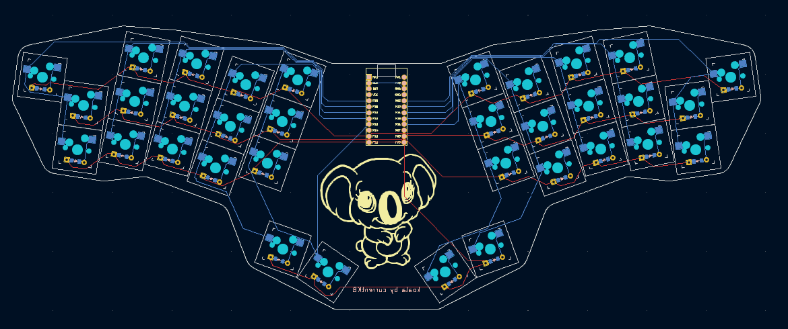

# The koala keyboard
This is a 34-key ergonomic unibody keyboard.

**This is work in progress**

The keyboard is inspired by the [clog-v4 keyboard from smores](https://github.com/smores56/clog-v4) and was built with the use of the [tutorial of FlatFootFox](https://flatfootfox.com/ergogen-introduction/).
Shout-out to both of them - thank you for your work.

To start with this project, I drew my finger movements on an iPad and placed the keys accordingly. The differences between the clog v4 and the koala is that the top key of the pinky cluster is moved up half a key, I added another 4° splay between index and middle finger, moved up the inner column half a key up and also moved the thumbs cluster more outwards (and what you for sure realized, the koala is a unibody design - not a split one). These changes are all based to my personal finger movements. There are also some technical differences - my board is based on a pro micro, instead of a seeduino xiao controller and I also used mx-switches, instead of choch-switches.

